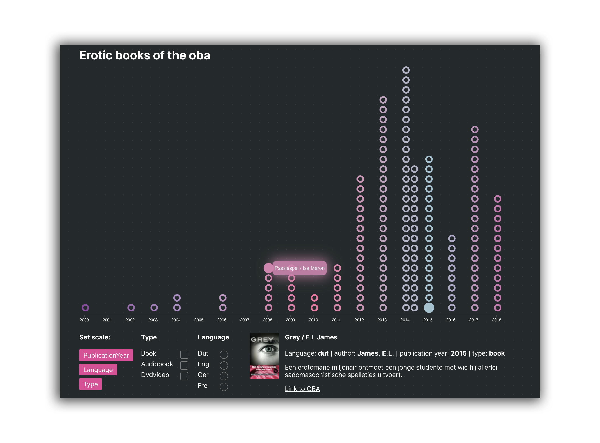
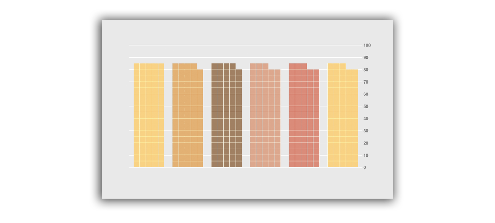
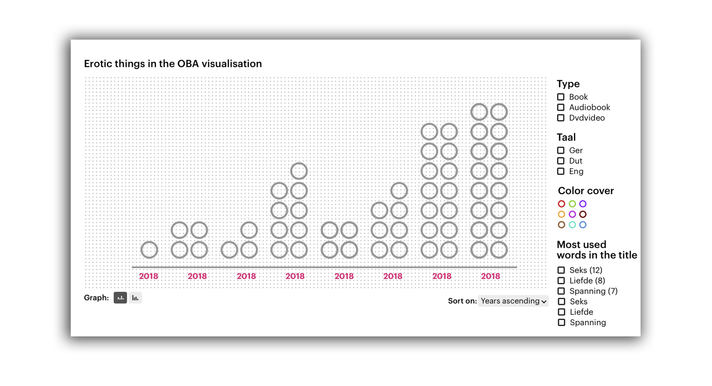

# Frontend-data

## Description

A visualisation of the eroic books from the OBA. Where users can explore themselves the graph by filtering and changing the scales. [The visualisation can be found here](https://denniswegereef.github.io/frontend-data/src/).



## Table of content

- [Installing](#installing)
- [Research questions](#research-questons)
- [Data](#data)
  - [Data needed](#data-needed)
- [Visualisation](#visualsation)
  - [Inspiration](#inspiration)
  - [Code](#code)
- [Conclusion](#conclusion)
- [Still to do](#still-to-do)
- [Credits](#credits)
- [Proces](#proces)

## Installing

To install this project you need to do a few things to get up and running. Don't forget it needs the public API key from the [Openbare Bibliotheek Amsterdam](https://www.oba.nl/).

#### This creates a localhost with all the filtered API data

```bash
# Clone the repository
git clone https://github.com/Denniswegereef/functional-programming

# Change directory
cd functional-programming

# Create a .env file
touch .env

# Add public and secret key to the .env file
echo "PUBLIC=987654321
SECRET=123456789" >> .env

# Install dependencies
npm install

# Start application
npm run getMore

```

The browser hosts all the data on `http://localhost:8080`

**When you wanna see the visualisation in your browser just open the src/ index.html**

## Data

### Data needed

As far as my previous project I wanted to continue on erotic books for now since there is a nice amount of items to work with. I also used the same code for fetching data. More information can be found at the [ functional-programming repo
](https://github.com/Denniswegereef/functional-programming) where there is more a indepth view of it and how it works.

As far as the data I added some more keys to data I'm using in the visualsation. It gaves me a little bit more data to play and manipulate it. For now I used the following data keys:

- Title
- Summary
- Main-author
- Publication-year
- Languages
- Physical-description
- Pages
- Direct link to the OBA website

## Visualisation

I want users to explore themselves the data of erotic books. The visualsation should be scalable without knowing te final outcome. So it's very flexible and easy to change.

### Inspiration

My inspiration came originally from some sort of histogram where each item is a reference to such as a book, dvd or a audiobook. It needs to have filters to modify the data and make it more the way they want to see it.



I had to clue how this kind of chart was called, it was some sort of a stacked bar chart but google refused to give me some nice examples.
After all I learned that it was a histogram on wednesday in the second week, so that's sad wish I knew it a week before.

Orginaly I wanted to use the force3d functionally in d3 where they are gravity based dots. But it didn't really add up for the experience so I actually moved on and used a more 'static' approach of viewing the items.

But since I stepped away from that this was my orginal sketch how things kinda should look like in some way.. atleats it gives me some grip on how I wanted to display my data. I created a small visual from how I wanted to kinda have it to look like.



### Code

The code used can be found in the `src/index.js` folder. The big challange was that the data could be updated with one single click. And there had to be a some kind of logic where it would dynamicly update. I made several iterations and some frustrations moments before I found how it actually did work.

In the code there is much going on, I've tried to put some comments by some parts that maby could be hard to understoond right of the bat. But the code has some kind of lifecycle.

- On render it gets all the data and puts it on the chart using the `currentGraph` variable
- It append all the possible filters
- When there is a update called, the data will be modified and displayed the right way, it rerenders the modified data to the screen

There are some interesting functions that needs some highlighting.

```js
createUniqueFilter('type', 'checkbox')
```

Renders based on the type you give it, such as `publicationYear` or `type`. It renders all the possible options as `checkbox` but there is also support for `radio` buttons.

This filter does alot more than just render the filtered items. It also makes a array of all the filters currently active and updates the data accordingly and rerenders the page when a checkbox or radio button is pressed. If there is a already filter active when it's unique, it throws the other one out, really neat 😱

```js
update(data, type)
```

The big one which is needed for updating the data. It rerenders if needed all the data and the scales accordingly on how you wanna update it. It also triggers to update the scale properly how much data there is available.

```js
updateScale(sortedYearsByAttr, attr)
```

The update scale, it can transform in a `linearScale` or `ordinalScale` based on which data is needed. Words are placed on the ordinal and numbers are on the linear. Makes it very flexible to change scales really fast if there is a type you wanna use.

```js
showSingle()
```

Renders a single book to the page where the user can read the title and the summary. Also it shows the attributes of the book and provides a link to the orginal page on the OBA website where it can be found.

```js
checkIfNumber(dataItem)
```

Some short helper function which transforms any string and check if it is a number, this part is needed for updating scales accordingly.

```js
uniqueKeys(obj, key, sort)
```

You want to put on your scale only the uqique keys and no doubles. This filters it and gives a array of all the unique ones back. It needs a `data` property such as a array of all individual books, a `key` where you wanna filter on and a sort that can be `asc` or `desc`.

That are some of the core features of my application but there are some small helpfull things. Such as when the single rounds reacht the top it breaks and goes on on the next line starting again from 0.

[Take a look in the full code here.
](https://github.com/Denniswegereef/frontend-data/blob/master/src/index.js)

## Conclusion

I can't say this wasn't hard. I thought I had it but it was alot of trail and error. Made some different varitations and tried first using a different approach with floating gravity balls. What sounded cool but it was really hard to modify right to my likings.

When I found how I wanted to display my data in the graph where everything was a unit. I had no clue how to actually google it so I had kinda had to make it myself. I used [this example](https://jsfiddle.net/2xyjf4nu/1/) as a base for everything. I just build and build upon it changing different things. I don't think I totally used another example, maby I took some parts but never more than 1 line of code mostly. I think 99% is writting and thought out by my own how to solve it.

I had alot of fun and frustration at the same time. When I first started I thought D3 was easy but as more complex some ideas going you can't really google it sometimes and you really need to wrap your head around to make it work like the way you want. Also some of the d3 block are nice but when they try to be clever, use short names, and no comment it makes a pain to solve it sometimes how it works.

But after all I'm really happy with how it turned out, I still wanted to add a bit more data but for now it does the job just right in my opinion. Learned alot from this project and you you had kind of create your own 'state management' yourself some time. I think I challanged myself with this piece just right. And I think I made some really clever ways to solve a problem. But still It's such a mess sometimes in the code and need to little rearange it.

Also what the fun is, the style here fits really well the eroic theme, just had to say it because I'm really happy how it turned out 💯!

### Insights

There are some cool insights from the attributes I currently have. Such as there came alot more erotic books the past years. But maby it's better that you look for yourself for some nice insights [here](https://denniswegereef.github.io/frontend-data/src/index.html).

## Still to do

Well there is s still alot to do and beautiful ideas. There are soooo many things you can still improve.

- [ ] Cleaing up my code
- [ ] Use the same code standards for every line
- [ ] Unit testing
- [ ] Adding more attributes and filters
- [ ] Code split a bit
- [ ] Mobile friendly
- [ ] Changing from a histogram to a bar chart
- [ ] Try avoiding global variables
- [ ] More scalable
- [ ] Support for different genres
- [ ] More animations!
- [ ] Logic where you can have over 150+ items displayed correctly
- [ ] Add the colors (had no time anymore 🚀 before the deadline)

## Credits/links

[Folkert-Jan van der Pol](https://github.com/FJvdPol)
[Titus Wormer](https://github.com/wooorm)

[This JSfiddle](https://jsfiddle.net/2xyjf4nu/1/)

[D3](https://d3js.org/)
[Oba API](https://zoeken.oba.nl/api/v1/)
