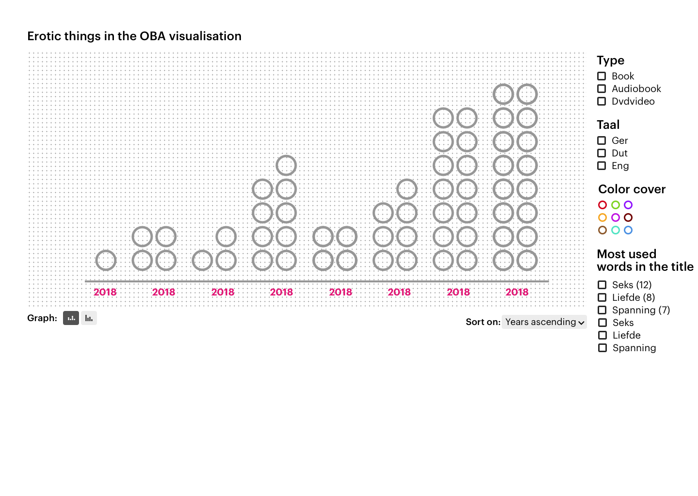

# frontend-data

Import data to use

- title
- summary
- main-author
- publication-year
- languages
- physical-description

- Video of book?

### First concept:

A timeline where every dot is a book. They are spaced when you launch the page first you see the years ascending to today (last year). Based on different filters you can move the dots to their correct place on the X.

There are animations for removing dots, entering dots etc.

The filters are based on the data avaliable and will load dynamicly, such as languages, authors. And maby some silly things as page count for books, or the amounts of words used in a summary, or the most common words used in a summary / title. Depending if it fits the theme.

**Functions**

Find unique key, desc or asc are optional

```js
uniqueKeys(data, 'year', asc)
```

Links

<!-- [Forced layout d3](https://d3indepth.com/force-layout/) -->

https://stackoverflow.com/questions/41215085/create-a-dot-chart-with-d3-js-showing-stacked-dots
